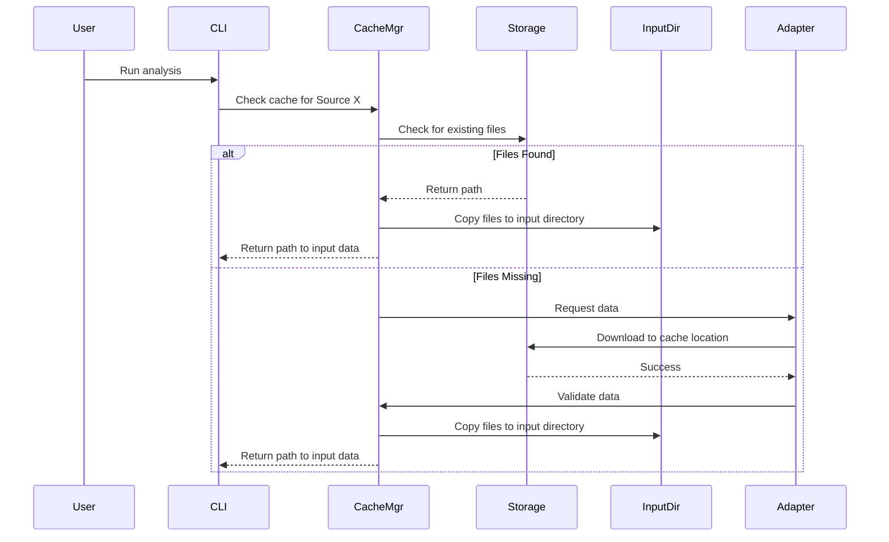
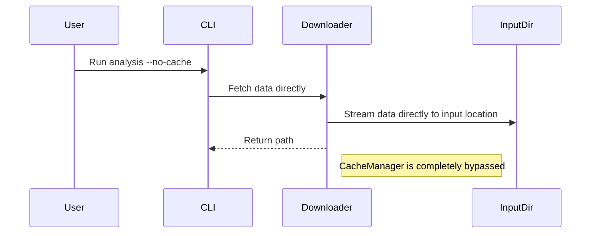
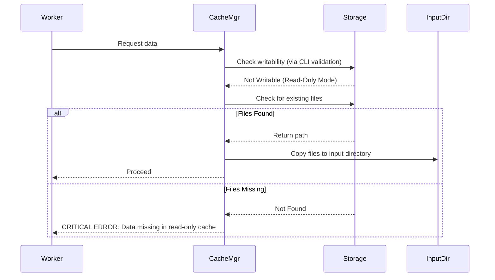

# Design Document: Dataset Cache

## Overview

This document outlines the design for a file-based caching subsystem within the
`brokenspoke-analyzer`. The system manages the retrieval, storage, and lifecycle
of datasets from multiple sources (US Census, LODES, OSM) that are expensive to
download repeatedly. We would like to prevent the tool to (re-)fetche these
assets unconditionally, wasting bandwidth and time, and making offline or
air-gapped execution impossible.

The core design philosophy prioritizes **safety** and **simplicity**:

1.  **Staging Area**: The cache acts as a temporary staging area. Data is
    downloaded to the cache, validated, and then copied to the final input
    directory (data store).
2.  **Mode Safety**: The system auto-detects operational mode (read-only vs.
    read-write) based on directory permissions. In read-only mode (cloud), if
    data is missing, the process fails immediately.
3.  **OSM Persistence**: OSM data is stored in a fixed `osm/latest/` directory
    but is **never overwritten automatically**. If data exists, it is reused.
    Manual cleanup is required via `cache clean osm`.
4.  **Extensibility**: A registry pattern allows new data sources to be added
    without modifying core cache logic.
5.  **Future-Proofing**: The storage layer utilizes the `obstore` library,
    enabling a seamless transition from local disk to cloud object storage.

## Architecture

### High-Level Components

The system consists of four primary layers:

1.  **CLI Interface**: Handles argument parsing (`--cache-dir`, `--no-cache`)
    using `typer`. Validates paths and modes at the entry point.
2.  **Cache Manager**: The orchestrator. Manages the storage backend,
    coordinates downloads, and handles the copy-to-input logic.
3.  **Source Registry & Adapters**: A dynamic registry of `SourceAdapter`
    implementations. Each adapter knows how to fetch, version, and validate a
    specific dataset.
4.  **Storage Backend**: An abstraction layer wrapping `obstore` to handle file
    I/O (local or future cloud).

### Data Flow Diagrams

#### Scenario A: Standard Analysis (Cache Hit)



#### Scenario B: Cache Bypass (--no-cache)



#### Scenario C: Cloud Pipeline (Read-Only Mode)



## Components and Interfaces

### 1. Cache Manager (`cache_manager.py`)

Responsible for orchestration, mode detection, and data movement.

**Key Methods:**

| Method                                               | Description                                                                                                                                                                                   |
| :--------------------------------------------------- | :-------------------------------------------------------------------------------------------------------------------------------------------------------------------------------------------- |
| `get_or_fetch(source: str, input_dir: Path) -> Path` | Checks cache. If found, copies to `input_dir`. If not found and mode is `ReadWrite`, downloads, validates, caches, then copies. If not found and mode is `ReadOnly`, raises `CacheMissError`. |
| `clear_source(source: str)`                          | Removes source directory from cache.                                                                                                                                                          |
| `list_cache()`                                       | Returns metadata about cached sources.                                                                                                                                                        |

**Mode Logic:**

- Mode is determined by the CLI layer (using `typer`'s path validation) and
  passed to the manager.
- **Critical**: If `mode == ReadOnly` and data is missing, raise
  `CacheMissError`.

### 2. Source Registry & Adapters (`sources/`)

Uses a registry pattern to manage data sources.

**Base Class (`SourceAdapter`):**

```python
from abc import ABC, abstractmethod
from pathlib import Path

class SourceAdapter(ABC):

    @property
    @abstractmethod
    def name(self) -> str:
        """Return the source name (e.g., 'census', 'lodes', 'osm')."""
        pass

    @abstractmethod
    async def fetch(self, storage: StorageBackend, temp_dir: Path) -> Path:
        """
        Downloads data to temp_dir.
        Returns path to the downloaded file.
        """
        pass

    @abstractmethod
    def get_version_key(self) -> str:
        """
        Returns the key used for versioning.
        Examples: '2023' for Census, 'latest' for OSM.
        """
        pass

    @abstractmethod
    def validate(self, data_path: Path) -> bool:
        """
        Validates file integrity.
        Returns True if valid, False otherwise.
        """
        pass
```

**Concrete Implementations:**

| Adapter         | Version Key         | Behavior                                  |
| :-------------- | :------------------ | :---------------------------------------- |
| `CensusAdapter` | Year (e.g., "2023") | Fetches US Census blocks data             |
| `LodesAdapter`  | Year (e.g., "2023") | Fetches LODES employment data             |
| `OsmAdapter`    | "latest"            | **Skips download if data already exists** |

**Registry:**

- Global dictionary: `SOURCE_REGISTRY: Dict[str, SourceAdapter]`
- Registration function: `register_source(adapter: SourceAdapter)`
- Lookup function: `get_adapter(name: str) -> SourceAdapter`

### 3. Storage Backend (`storage.py`)

Wraps `obstore` to provide a unified interface for local and future cloud
storage.

**Interface:**

| Method                                            | Description                          |
| :------------------------------------------------ | :----------------------------------- |
| `put_object(key: str, data: bytes)`               | Uploads data to storage              |
| `get_object(key: str) -> bytes`                   | Downloads data from storage          |
| `exists(key: str) -> bool`                        | Checks if object exists              |
| `list_prefix(prefix: str) -> List[str]`           | Lists files under a prefix           |
| `copy_to_local(source_key: str, dest_path: Path)` | Copies from cache to input directory |
| `delete_prefix(prefix: str)`                      | Deletes files under a prefix         |

**Local Implementation:**

- Uses `obstore.local.LocalFileSystem`
- Maps keys to absolute paths on disk

**Cloud Implementation (Future):**

- Swappable to `obstore.s3.S3FileSystem` or similar

### 4. CLI Handler (`cli/cache.py`)

Subcommand group: `brokenspoke cache ...`

**Commands:**

| Command  | Description                          | Flags                                     |
| :------- | :----------------------------------- | :---------------------------------------- |
| `dir`    | Prints the effective cache directory | None                                      |
| `clean`  | Removes cached data                  | `--source <name>`, `--dry-run`, `--force` |
| `status` | Shows disk usage and cached sources  | None (future)                             |

**Example Usage:**

```bash
# Show cache directory
brokenspoke cache dir

# Clean all cached data
brokenspoke cache clean

# Clean only OSM data
brokenspoke cache clean --source osm

# Dry run (show what would be deleted)
brokenspoke cache clean --dry-run

# Skip confirmation prompt
brokenspoke cache clean --force
```

## Data Models

### Directory Structure

The cache follows a hierarchy per source. OSM uses a fixed "latest" directory.

```text
<cache-root>/
├── census/
│   ├── 2020/
│   │   └── data.parquet
│   └── 2021/
│       └── data.parquet
├── lodes/
│   └── 2023/
│       └── employment.csv
└── osm/
    └── latest/
        └── region.osm.pbf
```

_Note: OSM data is stored in `osm/latest/` and is **never overwritten
automatically**. Manual cleanup via `cache clean osm` is required to refresh._

### Versioning Logic

- **Census/LODES**: Version is the integer year. Stored in `<source>/<year>/`.
- **OSM**: Version is always "latest". Stored in `<source>/latest/`. **Fetch is
  skipped if data already exists.**

## Correctness Properties

1.  **Atomic Staging**:
    - Downloads occur in a temporary directory (`<cache-root>/.tmp/<source>/`).
    - Upon success, the temp directory is moved to the final versioned location.
    - **Copy to Input**: Data is copied from the final cache location to the
      user's input directory. This ensures the input directory is never
      partially written.

2.  **Read-Only Enforcement**:
    - The CLI validates writability at startup.
    - If `ReadOnly`, any attempt to write (populate, invalidate) raises a
      `PermissionError`.
    - If data is missing in `ReadOnly` mode, the process fails immediately.

3.  **Data Integrity**:
    - `validate()` method in adapters ensures file integrity before moving to
      final cache location.
    - Copy to input directory is performed only after successful validation.

4.  **OSM Non-Overwrite Policy**:
    - If `osm/latest/` already contains data, the fetch is **skipped entirely**.
    - A log message informs the user: "OSM data already exists. Use
      `cache clean osm` to refresh."
    - This prevents unnecessary 75GB re-downloads.

5.  **Uncompress data**:
    - When fetched data are compress (`.zip`, `.gz`, etc.), they must be
      decompressed before being copied into the input dir, and the cache must
      only contain the uncompressed data.

6.  **Bypass Isolation**: When `--no-cache` is specified, `CacheManager.get`
    shall not read from or write to the cache directory for that call. This
    property is unit-tested by asserting that no `StorageBackend` methods are
    called during a bypass invocation.

7.  **Version Isolation**: Files from `census/2022/` shall never be accessible
    via a query for `census/2023/`. Version slugs are derived deterministically
    from the `version` argument and are never cross-contaminated.

## Error Handling

| Error Condition                         | Response                                                                        |
| :-------------------------------------- | :------------------------------------------------------------------------------ |
| **Network Failure**                     | Retry via `tenacity`. If exhausted, clean temp files and raise `DownloadError`. |
| **Cache Miss (Read-Only)**              | Raise `CacheMissError`. Process terminates.                                     |
| **Cache Miss (Read-Write)**             | Trigger download automatically.                                                 |
| **Invalid Data**                        | Raise `ValidationError`. Temp files removed.                                    |
| **Permission Denied**                   | If write attempted in read-only mode, raise `PermissionError`.                  |
| **Disk Full**                           | Raise `StorageError`. Clean temp files.                                         |
| **Temp dir creation fails (disk full)** | Raise `OSError` with context message                                            |
| **OSM data exists, skip download**      | Continue normally. Log the action with `DEBUG` level.                           |
| `clean --source <n>` unknown key        | Exit non-zero, list valid keys.                                                 |

### Error Types (`brokenspoke_analyzer/core/cache/errors.py`)

```python
class CacheError(Exception):
    """Base class for all cache errors."""

class CacheMissError(CacheError):
    """Raised in Read-Only mode when a required asset is absent."""
    def __init__(self, source: str, version: str) -> None:
        super().__init__(f"{source}/{version} not in cache (read-only mode)")

class ValidationError(CacheError):
    """Raised when a downloaded asset fails integrity checks."""

class UnknownSourceError(CacheError):
    """Raised when CacheManager receives an unrecognized source key."""
```

### Retry Strategy

Retry configuration (via `tenacity`):

```python
from tenacity import retry, stop_after_attempt, wait_exponential

@retry(stop=stop_after_attempt(3), wait=wait_exponential(multiplier=1, min=2, max=10))
async def _download_with_retry(adapter, version, dest, session): ...
```

## Logging Strategy

- All operations logged via `loguru`.
- Levels: `INFO` for normal operations, `WARNING` for fallbacks, `ERROR` for
  failures.
- Example: `logger.info("Copying {src} to {dst}")`.
- OSM skip:
  `logger.warning("OSM data already exists. Use 'cache clean osm' to refresh.")`.

All `loguru` log calls include structured context:

```python
from loguru import logger

logger.bind(source=source, version=version, path=str(final_path)).info(
    "Cached: {source}/{version} -> {path}"
)
```

## Integration

### Existing Pipeline Integration

1.  **Initialization**: CLI parses args, validates paths, sets mode.
2.  **Data Request**: Analyzer calls
    `cache_manager.get_or_fetch(source, input_dir)`.
3.  **Bypass**: If `--no-cache`, analyzer calls downloader directly to
    `input_dir`.
4.  **Pre-Population**: Separate script populates cache in cloud (write mode)
    before pipeline starts.

### Dependency Injection

- `StorageBackend` injected into `SourceAdapter`.
- `CacheManager` holds singleton `StorageBackend`.

## Testing Strategy

1.  **Unit Tests**:
    - Mock `StorageBackend` to test `SourceAdapter` logic.
    - Test `CacheManager` logic (copy, move, validation).
    - Test OSM skip behavior when data exists.
2.  **Integration Tests**:
    - Temporary directory setup.
    - Full cycle: Download -> Validate -> Move -> Copy to Input.
    - Verify OSM skip behavior (second fetch should not download).
3.  **Edge Cases**:
    - Disk full.
    - Corrupted download.
    - Missing data in read-only mode.

## Deployment Considerations

### Dependencies

- `platformdirs`: Cache directory resolution.
- `obstore`: Storage abstraction.
- `aiohttp`: HTTP downloads.
- `tenacity`: Retry logic.
- `typer`: CLI framework.
- `loguru`: Logging.

### Configuration

- **Environment Variable**: `BROKENSPOKE_CACHE_DIR`.
- **CLI Flags**:
  - `--source <name>`: (For `cache clean`) Target specific source.

### Migration

- No migration needed for existing installations.
- Future cloud migration: Update `StorageBackend` config.

## Notes

- **OSM Size**: Ensure `obstore` handles large file streaming efficiently.
- **OSM Persistence**: OSM `latest/` directory is **never overwritten
  automatically**. Users must run `cache clean osm` to refresh.
- **CLI Validation**: `typer` handles path writability checks, simplifying the
  cache manager's responsibility.
